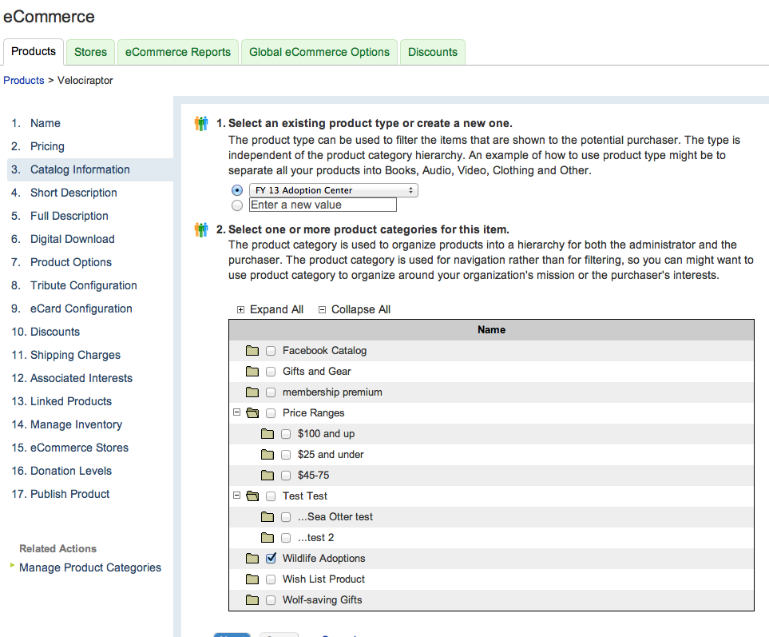

#Defenders of Wildlife Adoption Catalog
##Adding a Velociraptor
###1. Create the Velociraptor product in eCommerce
Open eCommerce in Convio and copy an animal that currently exists in the adoption catalog catalog that correlates to the level you wish to create *(i.e. copy Arctic Fox for Velociraptor, Arctic Fox Family for Velociraptor Family, Arctic Fox Group for Velociraptor Group)* and update the following:

*Note: Make sure you save after each step!*
	

**1. Identification**

	1. Enter a name for the product
	
	2. Select "Adoption & Gift Center (FY13)" security category for this product
	
	3. Choose "Higher" for the Product Priority
	
	4. Enter an external identifier for the product (the tracking code)
	
	5. Leave blank
	
	6. Leave blank
	 

**2. Pricing**

	
	1. Enter Standard Price

	2. Enter Fair market value for the product
	
	3. Leave blank
	

**3. Catalog Information**

	
	1. Select "FY 13 Adoption Catalog" as the existing product type
	
	2. Select "Wildlife Adoptions" as the product category for the item
	

**4. Short Description**

	

	1. Enter the animal name for the short description for the product
	
	2. Leave blank
	
	3. Upload an image to use as a thumbnail for the product
	

**5. Full Description**

	1. Leave Blank	
	

**6. Digital Download**

	1. Check "This product can be downloaded" if there is a download for the animal
	
	2. Check "Digital product can be retrieved from another location" and enter the URL for the digital product.
	
	3. Leave blank
	
	4. Leave blank
	

**7. Product Options**

	1. Leave the product options how they were copied and check the correspond with the following:
	Velociraptor
			* Would you like your adoption gift-wrapped in the reusable tote ($8)?
	Velociraptor Family
			* Would you like to receive the plush toy (Free)?
			* Would you like to receive the Kids Wildlife Activities Book (Free)?
			* Would you like your adoption gift-wrapped in the reusable tote ($8)?
	Velociraptor Group
			* Would you like to receive the plush toy (Free)?
			* Would you like to receive the Kids Wildlife Activities Book (Free)?
			* Would you like your adoption gift-wrapped in the reusable tote ($8)?
			

**8. Tribute Configuration**

	1. Make sure "This product can have a tribute message with it" is checked

	2. Leave the tribute fields how they were copied.

**9. eCard Configuration**

	1. Check "Use eCards selected below"

	2. Add any eCards that are directly linked with the product

**10. Discounts**

	1. Ensure all discounts are removed from "Your Selections"

**11. Shipping Charges**

	1. Check "This product requires a shipping address"

	2. Check "This product requires the standard shipping charge"

	3. Check "This product can only be shipped to US addresses"

	4. Leave "Additional shipping charge" unless product calls for additional shipping

	5. Check "This product supports express shipping"

	6. Input the express shipping charge ($6.00)

	7. Check "Yes, embed the shipping charge in the item price"

**12. Associated Interests**

	1. Check "Adoptions and Gifts" and "Adopt a Velociraptor"

**13. Linked Products**

	1. Ensure all products are removes from "Your Selections"

**14. Manage Inventory**

	1. Leave "Yes, track inventory for this product" unchecked (Important!)

	2. Leave "Yes, send notifications when threshold is breached or item goes out of stock" unchecked

	3. Leave "Possible configurations for this product" blank.

**15. eCommerce Stores**

	1. Select "3WEW1400XXXXX: FY14 Adoption and Gift Center TEG Redesign" is the only store added to "Your Selections"

**16. Donation Levels**

	1. Leave as is

**17. Publish Product**

	1. Preview the product

	2. Publish the product

**18. Product ID number**
	
	1. You'll need this 4 digit number when creating the product page.
	
	2. Write down the 4 digit number.

###2. Upload Veliciraptor Images for product page
Upload the following images with the following dimensions:

* Catalog Homepage - Animal Thumbnail - **202  x 141 **
* Catalog Homepage - Animal Plush Flyout - **240  x 100 **
* Animal Page - Slider Large - **1400 x 500 **
* Animal Page - Slider Medium - **900 x 400 **
* Animal Page - Sidebar Portrait Thumbnail  - **170 x Variable **
* Animal Page - Sidebar Portrait Full-size - **Variable x 1000 **
* Animal Page - Sidebar Landscape Thumbnail - **170 x Variable **
* Animal Page - Sidebar Landscape Full-size - **1000 x Variable **
* Animal Page - Product Level Plush Thumbnail - **140 x 140** 
* Animal Page - Product Level Plush Full-size - **1000 x 1000 **
* Animal Page - Product Level Factsheet Thumbnail - **140 x 140 **
* Animal Page - Product Level Factsheet Full-size - **1000 x 1000 **
* Animal Page - Product Level Bifold Thumbnail - **85 x 85 **
* Animal Page - Product Level Bifold Full-size - **1000 x 1000 **

Once uploaded, collect image urls in an excel file to keep organized. 

You will also need the Animal Certificate and Activities Book images that remain the same for every animal:
* Animal Page - Product Level Certificate Thumbnail - https://secure.defenders.org/ac/img/adoptions/certificates/thumbs/adoption-certificate.jpg
* Animal Page - Product Level Certificate Full-size - https://secure.defenders.org/ac/img/adoptions/certificates/large/adoption-certificate.jpg
* Animal Page - Product Level Activities Book Thumbnail - https://secure.defenders.org/ac/img/adoptions/activity%20book/activity-book_IMG_4330-thumb.jpg
* Animal Page - Product Level Activities Book Full-size - https://secure.defenders.org/ac/img/adoptions/activity%20book/activity-book_IMG_4330-large.jpg

